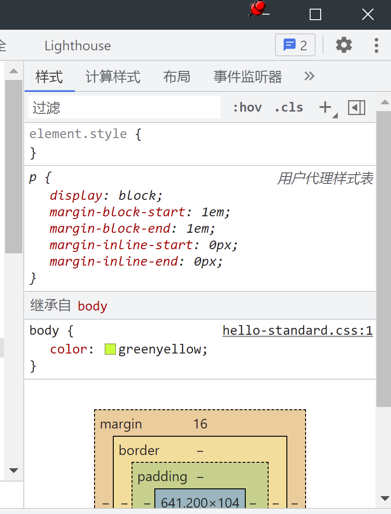

# CSS

> Cascading Style Sheets
> 层叠样式表

> 不需要了解所有的css，只需要了解常用的属性即可

## Color Styling in CSS

1. reserved color:red,green,等等（css中的默认保留色）
2. rgb:R,G,B分别是一个byte=8bits,总共有2^8次种可能，所以R,G,B都是256中选择
3. rgba:a是alpha，用于透明度的设置,可以放入0-1的值
4. hex:hexdecimal十六进制选择，记住这点就好
5. hsl(hue,saturation,lightness)

## CSS Selectors选择器

### Universal Selector

全局选择器:修改所有标签的样式

```css
*{
    color: green;
}
```

### element,id,class Selector

- id:独一无二的
- class:一类的，就是一个类别，可以设置一个类别的tag
- element:这里的element指的就是特定的tag

### grouping Selector

```css
h1,h2{

}
```

### desendant Selector

> 子选择器，类似继承关系???

> 比如说此时的hello.html中body就是h1标签的父标签

### attribute Selector

> 假设此时要设置所有文本形式的input标签颜色为红色，就需要用到attribute Selector

### Pseudo-classes

> Pseudo-classes,css伪类
> css伪类用于定义元素的特殊状态

应用举例

- 当用户将鼠标悬停在元素上时为其设置样式
- 样式访问和未访问的链接不同
- 获得焦点时设置元素样式

常用的pseudo-classes

- hover:鼠标移动到那里，设定css样式
- active:鼠标点的一瞬间，设定css样式
- focus:鼠标点击后，直到下一次点击前，设定css样式


### Pseudo-elements

> css伪元素
> css伪元素用于设置元素的**指定部分**的样式

- 为元素的第一个字母或行设置样式
- 在元素内容之前或之后插入内容

::selection 选取元素的时候，元素显示的颜色

### cascade概念

> 之前我们一直在写的其实是style sheet，接下来要理解一下cascade的概念
> cascade是css中增加样式的一个准则(不是唯一，但是非常重要)

1. 浏览器读取css的时候，是从第一行读取到最后一行的（同tag同属性同优先级，后面写的会覆盖前面写的）
2. 关于优先级:id>class>tag
   可以这样理解
   - id          specificity(1,0,0)
   - class       specificity(0,1,0)
   - tag         specificity(0,0,1)
   - tag.class   specificity(0,1,1)
   - div.link1 a specificity(0,1,2)
   - ......
3. css inheritance(css继承):
   css属性可以分为两类
   1. inherited properties：由parent element继承而来。
   2. non-inherited properties：自己本身就设定好的(优先级高)。
   
4. inline styling优先级高于external styling

### text-styling

#### font-size

units in CSS

css中有两种单位
1. 绝对单位:px,如果在chrome中对网页字体进行大小调整的话，该网页的字体大小字体还是不变
2. 相对单位:em(相对父元素),rem(相对根元素)

### text-align

> 文字靠左、中、右

### text-decoration

> line-through设置删除线,underline设置下划线

### line-height

> 设定行高

### letter spacing

> 设置字间距

### font-family

> 设置字体

关于如何设置其他字体
前往(google fonts)[https://fonts.google.com/]网站，选择对应的字体，复制link，粘贴到html的css的link**上方**，然后再复制相应的字体，粘贴到css文件的font-family中去

### font-weight

字体的粗度，默认是400

### text-indent

> 就是开头空两格那玩意

## Background

### background-color

> so easy

### background-image

> cover:放到最大，知道宽度或者高度填满整个页面
> contain:尽量以最大展示(不超过原图大小),如果填不满则默认重复
> background-repeat:no-repeat不要重复

### background-position

> 一般都选择center

### background-shorthand

background可以代表background-color以及background-image

# 杂

## em和rem的区别

- 共同点:都是相对大小
- em:相对的是父元素
- rem:相对的是根元素