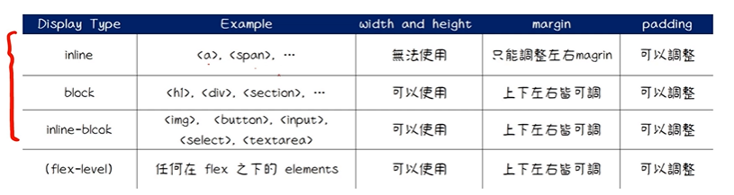

# CSS

> Cascading Style Sheets
> 层叠样式表

> 不需要了解所有的css，只需要了解常用的属性即可

## Color Styling in CSS

1. reserved color:red,green,等等（css中的默认保留色）
2. rgb:R,G,B分别是一个byte=8bits,总共有2^8次种可能，所以R,G,B都是256中选择
3. rgba:a是alpha，用于透明度的设置,可以放入0-1的值
4. hex:hexdecimal十六进制选择，记住这点就好
5. hsl(hue,saturation,lightness)

## CSS Selectors选择器

### Universal Selector

全局选择器:修改所有标签的样式

```css
*{
    color: green;
}
```

### element,id,class Selector

- id:独一无二的
- class:一类的，就是一个类别，可以设置一个类别的tag
- element:这里的element指的就是特定的tag

### grouping Selector

```css
h1,h2{

}
```

### desendant Selector

> 子选择器，类似继承关系???

> 比如说此时的hello.html中body就是h1标签的父标签

### attribute Selector

> 假设此时要设置所有文本形式的input标签颜色为红色，就需要用到attribute Selector

### Pseudo-classes

> Pseudo-classes,css伪类
> css伪类用于定义元素的特殊状态

应用举例

- 当用户将鼠标悬停在元素上时为其设置样式
- 样式访问和未访问的链接不同
- 获得焦点时设置元素样式

常用的pseudo-classes

- hover:鼠标移动到那里，设定css样式
- active:鼠标点的一瞬间，设定css样式
- focus:鼠标点击后，直到下一次点击前，设定css样式


### Pseudo-elements

> css伪元素
> css伪元素用于设置元素的**指定部分**的样式

- 为元素的第一个字母或行设置样式
- 在元素内容之前或之后插入内容

::selection 选取元素的时候，元素显示的颜色

### cascade概念

> 之前我们一直在写的其实是style sheet，接下来要理解一下cascade的概念
> cascade是css中增加样式的一个准则(不是唯一，但是非常重要)

1. 浏览器读取css的时候，是从第一行读取到最后一行的（同tag同属性同优先级，后面写的会覆盖前面写的）
2. 关于优先级:id>class>tag
   可以这样理解
   - id          specificity(1,0,0)
   - class       specificity(0,1,0)
   - tag         specificity(0,0,1)
   - tag.class   specificity(0,1,1)
   - div.link1 a specificity(0,1,2)
   - ......
3. css inheritance(css继承):
   css属性可以分为两类
   1. inherited properties：由parent element继承而来。
   2. non-inherited properties：自己本身就设定好的(优先级高)。
   
4. inline styling优先级高于external styling

### text-styling

#### font-size

units in CSS

css中有两种单位
1. 绝对单位:px,如果在chrome中对网页字体进行大小调整的话，该网页的字体大小字体还是不变
2. 相对单位:em(相对父元素),rem(相对根元素)

### text-align

> 文字靠左、中、右

### text-decoration

> line-through设置删除线,underline设置下划线

### line-height

> 设定行高

### letter spacing

> 设置字间距

### font-family

> 设置字体

关于如何设置其他字体
前往(google fonts)[https://fonts.google.com/]网站，选择对应的字体，复制link，粘贴到html的css的link**上方**，然后再复制相应的字体，粘贴到css文件的font-family中去

### font-weight

字体的粗度，默认是400

### text-indent

> 就是开头空两格那玩意

## Background

### background-color

> so easy

### background-image

> cover:放到最大，知道宽度或者高度填满整个页面
> contain:尽量以最大展示(不超过原图大小),如果填不满则默认重复
> background-repeat:no-repeat不要重复

### background-position

> 一般都选择center

### background-shorthand

background可以代表background-color以及background-image

### css box model

> css中最重要的模型

一个box包含了content，content外是border，content和border之间的距离是padding，border和其他块之间的距离就叫margin

> **所有html element都是box**
> width、height、content、border、padding、margin(这些东西所有html tag都具备！！！)

padding快速设定方式

```css
//分别代表上、右、下、左
padding: 2px 10px 6px 12px;
//分别代表上下
padding: 2px 4px;
//一起设置
padding: 20px;
```

margin的设定和padding基本类似

border的设定
可见MDN文档https://developer.mozilla.org/zh-CN/docs/Web/CSS/border

可以对tag设定width和height(会改变块级元素和内联元素)

### Relative units(相对单位)

> %,vw,vh

> viewpoint指的是人所看见的界面大小，该大小会随着界面的缩放而该改变

1. %:设置width,height的时候要相对于该tag的parent tag的width和height
2. vw(viewpoint width):viewpoint电脑的界面大小,设置为10vw,等价于设置10%*viewpoint
3. vh(viewpoint height):类比vw

问题：设定width和height属性为10vw、10vw，但是拖拉页面大小，元素大小却不会发生改变(解释见下方)

### block vs inline

二者在排版上的差别
1. block element width by default = 100% of parent element
2. inline element 不能设定width和height(不能设定指的是，不论对inline element的height、width做什么设定，浏览器都不会将该设定应用到网页排版上面)

所以应该如何修改css是的inline element能修改width和height呢？
这就涉及到了css中的一个重要属性*display*

### Display

> display就是展示展现的意思

> html中的标签分为inline、block,但实际上我们是可以通过修改对应的属性对tag预设的属性值进行更换

问题：img明明是inline element，但是我们却可以在css中对其进行height和width属性值的设定

这就是因为**inline-block**,它既是inline element,也是block element

先来看inline-block的inline部分

首先inline element的初始宽度是由它的content决定的，举个例子，a tag的初始宽度就由其网站长度决定
所以说，对于inline element而言，只要它的宽度没由超过网页的宽度，它是会从左到右不断排列下去的

再来看block element，区别就是它可以设定width和height

而inline-block这个属性就是inline和block的混合
1. 在网页排版上，符合inline的排版方式
2. 在width和height的设定上，又符合block的设定方式

总共5个inline-block tag
1. **img**
2. **input**
3. **button**
4. **select**
5. **textarea**

### margin进阶

> 可以为任何tag设定margin属性，但是对于inline tag而言，margin的高度不会产生任何作用（W3C网站上有，W3C是定义html规范的网站，有什么具体细节不理解的地方都可以去上面查看相关文档）



### CSS Position

> CSS元素的位置，它们互相排版的相对位置

上面的三个很少用到
但是没用为啥要学捏？
因为它们跟css的背后逻辑有关，理解认识它们有助于理解认识css的背后逻辑
1. static:静态的，是css中默认的预设值，任何css中的元素，未设定状态下都是static位置
   - The element is positioned according to the normal flow of the document.
   css中的排版，inline默认左到右，block默认上到下
   - No Stacking context.(暂时不理解)

2. relative
   - relative to itself(相对于它自己) based on the values of top,right,bottom,and left.
   - Stacking context!
   ```css
      position: relative;
      top: 200px;距离顶部下移200px
      /* bottom,left,right,top */
   ```
   如何解决元素覆盖的问题
   使用`z-index`，z-index越大，它就越处于视图的顶层
   但是有时候`z-index`会失效，这是为什么呢？
   因为`z-index`对于默认的static是无效的，对于position为其他的值都有效
3. absolute
   
4. **Fixed**
5. **Sticky**

### CSS中的x,y,z轴

x,y轴就是页面轴，z轴则是从平面中投射出来的轴

css属性`z-index`
# 杂

## em和rem的区别

- 共同点:都是相对大小
- em:相对的是父元素
- rem:相对的是根元素